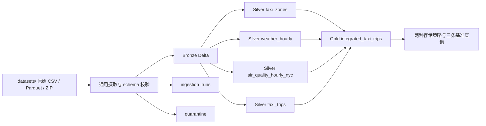

# 城市数据集作业：完整中文翻译、数据盘点与实施方案

> 项目根目录：`D:/DD2221/ID2221-main/Week1`  
> 当前状态：Spark + Delta 摄取、验证、集成、基准测试和最终报告已在 **Windows 原生**环境完成并验收（最后同步：2026-09-12）。
> 设计结论见 [design_report.md](design_report.md)，基准结论见 [benchmark_report.md](benchmark_report.md)，运行命令以 [README.md](../README.md) 为准。机器可读证据：`artifacts/data_profile.json`、`artifacts/ingestion_verification.json`、`artifacts/integration_verification.json`、`artifacts/benchmark_report.json`。

## 一、文档内容 1:1 中文翻译

### 第 1 周：构建一个通用的城市数据集成平台

假设我们已经从几个相互独立的部门收集了数据。每个部门以不同的格式存储数据，使用不同的命名约定，并且独立更新自己的数据。你的任务是构建一个可复用的数据工程平台，它能够把异构数据集成到一个统一的分析存储库中。

你会获得以下数据集。请从[此处](https://drive.google.com/drive/folders/1qjBtPVDepDE22j0axqrLVR0A2a969Qyy?usp=sharing)下载这些数据集。

| 数据集 | 格式 | 特征 | 链接 |
| --- | --- | --- | --- |
| 出租车行程 | Parquet | 非常大的事实表 | [链接](https://home4.nyc.gov/site/tlc/about/tlc-trip-record-data.page?utm_source=chatgpt.com) |
| 天气 | CSV | 每小时观测值 | [链接](https://www.ncei.noaa.gov/products/land-based-station/integrated-surface-database?utm_source=chatgpt.com) |
| 空气质量 | CSV | 传感器测量值 | [链接](https://aqs.epa.gov/aqsweb/airdata/download_files.html?utm_source=chatgpt.com) |
| 出租车区域查找表 | CSV | 查找表 | [链接](https://d37ci6vzurychx.cloudfront.net/misc/taxi_zone_lookup.csv) |

在本周结束时，你的平台应当能够自动完成以下工作：

- 摄取所有数据集；
- 验证它们；
- 将它们标准化；
- 把它们集成为一个统一的分析数据集，用上下文信息丰富每一条出租车行程；
- 把所有数据集以及集成后的数据集存储为 Delta 表。

### 任务 1：研究数据

在实现平台之前，先理解这些数据集的特征。为每个数据集创建一个数据目录，其中包含以下信息：

1. 该数据集表示的主要实体是什么？
2. 哪些属性能够唯一标识一条记录（即，该数据集的主键是什么）？
3. 哪些属性可能用于连接？
4. 哪些属性是时间属性？
5. 哪些属性包含类别值？
6. 哪些属性可能会随着时间增长？

### 任务 2：设计存储架构

设计一个用于存储这些数据集的存储架构。请设计：

- 目录结构；
- Delta 表的组织方式；
- 命名约定；
- 分区策略。

讨论以下设计决策：

- 从概念上看，哪些数据集应当被视为查找表？
- 哪些数据集不应当分区？请解释原因。
- 哪些数据集需要不同的分区策略？
- 在什么情况下，分区会变得有害？
- 如果数据总量增加 20 倍，你会对存储设计做出哪些调整？

### 任务 3：构建一个通用摄取框架

实现一个能够把异构数据集摄取到你的数据平台中的数据摄取框架。你的框架应当自动完成以下工作：

- 从不同的文件格式（例如 CSV 和 Parquet）加载数据集；
- 验证输入 schema；
- 按照你的命名约定标准化列名；
- 规范化时间戳以及其他常见数据类型；
- 应用数据集特定的转换规则；
- 执行基本的数据质量检查（例如重复记录、主键缺失、无效时间戳和无效数值）；
- 把处理后的数据存储为 Delta 表；
- 生成摄取元数据，例如已处理记录数、被拒绝记录数、执行时间和 schema 版本。

在报告中说明并论证以下问题：

1. 哪些组件对所有数据集都是通用且可复用的？
2. 哪些组件仍然是数据集特定的？为什么？
3. 转换规则是如何定义和维护的？
4. 元数据（例如 schema 版本、摄取统计信息）是如何管理的？
5. 你的设计如何减少代码重复并简化未来的维护？
6. 如果市政府明年新增 20 个数据集，你的框架需要做出哪些改动？

### 任务 4：设计一个通用数据模型

这些数据集使用不同的时间戳格式、schema、属性名称等。请设计一个会在整个项目中使用的通用表示。你的实现应当定义：

- 一种标准时间戳格式；
- 一致的命名约定；
- 缺失值处理规则；
- 通用数据类型。

记录每一项转换。

### 任务 5：构建集成流水线

实现一条流水线，用最相关的上下文信息丰富每一条出租车行程。创建一个 Delta 表（例如 `integrated_taxi_trips`），其中每一行表示一条出租车行程，并包含：

- 上车时间的天气状况；
- 上车时间的空气质量测量值；
- 上车区域；
- 上车行政区；
- 下车区域；
- 下车行政区。

你的实现应当定义并论证集成策略。例如：

- 应当如何把每小时天气观测值关联到一条出租车行程？
- 应当如何把每小时空气质量测量值关联到一条出租车行程？
- 应当如何处理缺失的观测值？
- 你的集成策略有哪些局限？

### 任务 6：对你的设计进行基准测试

评估你的实现的可扩展性。为出租车行程数据集实现两种不同的存储策略（例如，不同的分区方案）。测量：

- 摄取时间；
- 存储大小；
- 查询延迟；
- 生成的文件数量。

在两种存储设计上运行以下查询：

- 每个行政区的出租车行程数量；
- 每天的平均行程时长；
- 每个行政区的平均车费。

### 交付物

每个小组应提交：

1. 源代码，即完整的 Spark 项目，包括摄取框架、验证、转换、集成流水线、基准测试代码和配置文件；
2. 一份 3–5 页的设计报告，包含数据目录、存储架构、通用数据模型、摄取框架、集成策略、工程决策和权衡；
3. 一张架构图；
4. 一份简短的基准测试报告，包含评估过的存储策略、基准测试结果以及对性能的讨论；
5. 一份说明如何运行该平台的 README。

## 二、已经下载的数据集

项目的 `datasets/` 子目录包含 6 个权威源文件和一个空气质量解压缓存。天气、区域查找表和空气质量压缩包来自 Google Drive 共享目录；三个出租车 Parquet 因 Drive 下载速度异常缓慢，改从题目列出的 NYC TLC 官方源下载同名、同月份文件。报告不声称这三个官方文件与 Drive 副本逐字节相同。`hourly_88101_2024.csv` 与 ZIP 内唯一条目逐字节一致，因此只作为读取缓存，不作为独立数据集重复计数。

同级 `D:/DD2221/data/`（或镜像目录）按用户要求可保留为备份。项目实现只读取 `Week1/datasets/`，不依赖或自动同步镜像。

| 文件 | 当前已确认内容 | 角色 |
| --- | --- | --- |
| `yellow_tripdata_2024-01.parquet` | 49,961,641 字节，2,964,624 行，19 列 | 2024 年 1 月黄色出租车事实数据 |
| `yellow_tripdata_2024-02.parquet` | 50,349,284 字节，3,007,526 行，19 列 | 2024 年 2 月黄色出租车事实数据 |
| `yellow_tripdata_2024-03.parquet` | 60,078,280 字节，3,582,628 行，19 列 | 2024 年 3 月黄色出租车事实数据 |
| `weather.csv` | 1,073,711 字节，8,784 行，24 列 | 2024 全年逐小时天气数据 |
| `taxi_zone_lookup.csv` | 12,331 字节，265 行，4 列 | 出租车区域维表 |
| `air_quality.zip` | 66,347,589 字节；内含 2,365,678,973 字节的 `hourly_88101_2024.csv`，8,139,551 行，24 列 | 2024 全年美国 PM2.5 小时数据 |

### 数据覆盖关系

- 出租车数据只覆盖 2024 年第一季度，合计 9,554,778 行。
- 天气数据覆盖 2024 年全年，包括闰年的 366 天，共 `366 × 24 = 8,784` 个整点；时间键完整且无重复。
- 区域表覆盖 `LocationID` 1–265。出租车文件中实际出现的所有上车和下车区域 ID 都能命中该表。
- 天气文件没有站点 ID、经纬度或行政区字段。它只能作为一条全市级时间序列使用，不能从现有字段证明它代表哪个具体站点，也不能按出租车区域选择最近气象站。
- 空气质量是美国全国数据，不能整表直接连接纽约出租车。筛选纽约州和纽约市五县后得到 51,885 行、6 个站点；实际有数据的县只有 Bronx、Kings 和 Queens。

## 三、基于实际文件的数据目录

### 1. 出租车行程

- **主要实体：** 一次黄色出租车行程。
- **主键：** 源数据没有显式行程 ID，也没有已证明唯一的自然键。建议在清洗后对标准化业务字段计算 `trip_id` 哈希，并在哈希冲突或完全重复时隔离复核；不要用不稳定的 Spark 行号作为跨运行主键。
- **连接属性：** `PULocationID`、`DOLocationID` 分别连接区域表；`tpep_pickup_datetime` 连接天气和空气质量。
- **时间属性：** `tpep_pickup_datetime`、`tpep_dropoff_datetime`。
- **类别属性：** `VendorID`、`RatecodeID`、`store_and_fwd_flag`、`PULocationID`、`DOLocationID`、`payment_type`。
- **随时间增长的属性：** 行程记录本身持续增长；金额、距离等是每条记录的度量值，不是分区键。

已确认的数据质量现象：

- 5 个字段在三个月中各有 751,962 个空值：`passenger_count`、`RatecodeID`、`store_and_fwd_flag`、`congestion_surcharge`、`Airport_fee`。
- 2,801 条记录的下车时间不晚于上车时间。
- 56 条记录的上车时间落在文件名所示月份之外；最早时间甚至回到 2002 或 2008 年。
- 136,567 条记录的 `fare_amount` 为负，115,895 条记录的 `total_amount` 为负。负金额可能表示退款或冲正，不能在没有业务定义时全部删除。
- `trip_distance` 没有负数，但最大值达到 312,722.3，明显需要范围检查或异常标记。

### 2. 天气

- **主要实体：** 某一整点的一组天气观测值。
- **主键：** 组合字段 `year + month + day + hour`；实测 8,784 个时间键全部唯一。建议摄取时合成为 `observation_ts`。
- **连接属性：** 合成后的 `observation_ts` 与出租车上车时间取整后的小时连接。
- **时间属性：** `year`、`month`、`day`、`hour`。
- **类别属性：** 所有 `*_source` 列，以及编码字段 `cldc`、`coco`。
- **随时间增长的属性：** 每小时新增一条观测记录。

已确认的数据质量现象：

- `snwd`、`snwd_source`、`wpgt`、`wpgt_source` 四列全年完全为空。
- `prcp` 缺失 553 行；`coco` 与 `coco_source` 各缺失 6 行。
- 温度范围为 -11.1 至 35.6，相对湿度 15–97，降水量 0–27.7，风速 0–63，气压 982.0–1048.6。
- 数据没有声明时区。出租车时间通常是纽约本地时间，但仍必须从数据来源或课程说明确认天气小时的时区；在确认前不能把小时相等当作已证明正确的语义。

### 3. 出租车区域查找表

- **主要实体：** 一个 TLC 出租车区域。
- **主键：** `LocationID`，实测唯一且无空值。
- **连接属性：** `LocationID` 分别连接出租车的上车和下车区域 ID。
- **时间属性：** 无。
- **类别属性：** `Borough`、`Zone`、`service_zone`。
- **随时间增长的属性：** 当前不是持续追加表；仅在官方调整区域定义时低频变化。
- **定位：** 典型的小型查找表，不应按任何字段分区，应在 Spark 连接中广播。

### 4. 空气质量

- **主要实体：** 某个监测站点、仪器通道在某一小时的一次 PM2.5 测量。
- **主键：** 候选复合键为 `State Code + County Code + Site Num + Parameter Code + POC + Date Local + Time Local`。在纽约市子集的 51,885 行中实测无重复。
- **连接属性：** 时间连接优先使用 `Date GMT + Time GMT` 合成的 UTC 小时；空间属性包括州、县、站点、纬度和经度。
- **时间属性：** `Date Local`、`Time Local`、`Date GMT`、`Time GMT`、`Date of Last Change`。
- **类别属性：** 州/县/站点代码、`Parameter Code`、`POC`、`Datum`、`Parameter Name`、`Units of Measure`、`Qualifier`、`Method Type`、`Method Code`、`Method Name`。
- **随时间增长的属性：** 每个站点和仪器通道每小时新增测量记录。

已确认的数据质量与覆盖情况：

- 全国文件有 8,139,551 行、925 个站点，参数代码全部为 `88101`，单位全部为 `Micrograms/cubic meter (LC)`，即当地条件下的微克/立方米。
- 全国测量范围为 -10.0 至 1,435.0，共 211,323 条负值，需要结合 AQS 质量标志解释或隔离；不能直接当作有效浓度。
- `Uncertainty` 全部为空；`Qualifier` 有 7,487,648 个空值。
- 纽约市筛选结果只覆盖 Bronx、Kings 和 Queens 的 6 个站点，没有 New York（Manhattan）或 Richmond（Staten Island）站点。
- 纽约市子集覆盖 2024 年全部 8,784 个本地小时，每小时 4–6 条观测，平均 5.91 条；测量范围为 0.4–175.9，且没有负值。
- 由于每小时有多条站点观测，不能直接按小时连接出租车，否则一条行程会被复制 4–6 次。

## 四、应该采用的实现方案

### 1. 存储分层

当前 `datasets/` 中的 CSV、ZIP 和 Parquet 视为只读输入。实现阶段按下面的目标结构增加代码和生成目录，不再移动数据或制造新的运行副本：

```text
Week1/
├── README.md                          项目入口与当前状态
├── AGENTS.md                          后续开发约束
├── datasets/                          已验证的项目输入
│   ├── *.csv, *.parquet, air_quality.zip
│   └── SHA256SUMS.txt
├── config/datasets.yml                 四个数据契约
├── src/urban_data/                     Spark + Delta 实现
├── tests/                              标准库 unittest
├── scripts/profile_data.py            已实现的数据画像工具
├── artifacts/data_profile.json        已生成的画像证据
├── docs/assignment_and_implementation.md
└── lakehouse/                          [运行时生成]
    ├── bronze/
    ├── silver/
    ├── gold/integrated_taxi_trips/
    ├── quarantine/
    └── metadata/ingestion_runs/
```

Bronze 保留原始字段和值，并增加 `_source_file`、`_source_sha256`、`_ingested_at`、`_run_id`、`_schema_version`。Silver 使用统一命名和类型。Gold 只承载已经定义好粒度的分析表。这样既满足“所有数据集及集成结果存为 Delta 表”，也保留可追溯性。



### 2. 命名、类型和缺失值规则

- 表名和列名统一使用小写 `snake_case`，例如 `tpep_pickup_datetime` 保持为 `pickup_ts_local` 或明确转换为 `pickup_ts_utc`。
- 时间必须同时记录语义和时区。确认源时区后，把分析键统一为 UTC 时间戳；如业务需要，再保留纽约本地时间列。未确认时区时应让摄取失败或标记为待确认，不能静默假设。
- ID 使用整数；金额和测量值使用合适精度的数值类型；布尔语义字段转换为布尔值；原始编码值在 Bronze 保留。
- 必填主键或时间字段缺失时进入 quarantine。允许缺失的测量值保留为 `NULL`，不改成 0。
- 不做无依据的插值。天气或空气质量没有匹配时保留行程，环境字段为 `NULL`，并写入 `weather_match_status`、`air_quality_match_status`、`weather_observation_ts_local`、`air_observation_ts_utc` 以及 lag 分钟字段。

### 3. 分区策略

- `taxi_zone_lookup` 不分区：只有 265 行，分区只会制造小文件和目录开销。
- `weather` 当前不分区：全年只有 8,784 行，整表广播比目录裁剪更简单。
- 空气质量全国原表有 814 万行，Silver 可按 `year_month` 分区，并在摄取初期就按州/县裁剪项目所需范围。纽约市聚合后的小时表只有 8,784 行，不再分区并可广播。
- 出租车 Silver 和集成 Gold 表按稳定的 `source_file_month` 分区，用于安全重建每个月的源文件输出；业务派生的 `pickup_month` 保留为普通列，避免文件月份外的行程覆盖其他月份分区。
- 基准测试比较“未分区”与“按 `pickup_month` 分区”两版，输入为三个月出租车 Parquet 源文件（经 Silver 接受规则处理后 9,551,977 行）。Windows 本机实测（2026-09-12，`artifacts/benchmark_report.json`）：
  - **源文件 → Delta 摄取时间：** 未分区 18.5 s，分区 17.3 s（几乎持平）；
  - **存储：** 815.0 MiB / 10 文件 vs 820.0 MiB / 23 文件（Delta `DESCRIBE DETAIL` 统计）；
  - **三条全范围查询中位数：** 未分区 528 / 491 / 539 ms，分区 559 / 506 / 510 ms（几乎持平，SHA-256 一致）。
  - **默认推荐未分区**（文件更少、运维更简单）；只有月过滤或保留策略成为主要负载时才重新引入月分区。详见 [benchmark_report.md](benchmark_report.md)。
- 分区在以下情况下有害：分区键高基数、数据严重倾斜、单分区数据太少、查询不按分区键过滤，或写入产生大量小文件。
- 数据量增加 20 倍后，再根据真实查询过滤模式考虑按日分区、周期性压缩小文件、按时间和区域聚簇，并把目标文件大小控制在约 128–256 MB。不要仅因数据变大就增加分区层级。

### 4. 最小可复用摄取框架

通用部分只需要负责：文件发现与格式读取、物理 schema 校验（Parquet 列名/顺序/兼容类型；CSV 列名 + FAILFAST 类型解析）、通用列名规范化、运行元数据、质量结果汇总、Delta 写入和错误处理。每个数据集的差异通过一份简短配置和一个必要时才存在的转换函数表达：

```text
dataset config
  format, path, schema_version, expected_schema,
  column_mapping, primary_key, timestamp_rules,
  quality_rules, partition_columns
```

数据集特定部分包括：出租车金额与行程时长规则、天气时间列合成、空气质量站点/污染物聚合、区域表的唯一键检查。不要为每个数据集复制一套完整读取和写入代码。

`ingestion_runs` 至少记录 `run_id`、`dataset_name`、`source_file`、`source_sha256`、`schema_version`、读入/写出/拒绝行数、开始/结束时间、状态和错误摘要。`status` 包括 `success`、`skipped`、`failed`。相同源哈希与 schema 版本已经成功处理时，应跳过并写入 skipped 元数据；失败运行写入 failed 元数据。

第一版代码控制在下面核心模块内：

```text
src/urban_data/
├── main.py           CLI、SparkSession 和运行编排
├── ingest.py         通用读取、元数据、Delta 写入和 quarantine
├── validation.py     物理 schema 校验（列名 + Parquet 类型）
├── transforms.py     四个数据集的必要转换与质量规则
├── taxi_sources.py   基准测试：从源 Parquet 加载接受行程
├── integrate.py      区域、天气、空气质量连接
└── benchmark.py      两种存储策略、三条查询和指标落盘
```

实际命令合同由 README 的 Windows 入口脚本提供（WSL 流程见 README Legacy 节）：

```powershell
$project = "D:\DD2221\ID2221-main\Week1"
$env:JAVA_HOME = "D:\anaconda3\envs\id2221-week1\Library"
& "$project\scripts\run_win.ps1" ingest --dataset all
& "$project\scripts\run_win.ps1" integrate
& "$project\scripts\run_win.ps1" benchmark
& "D:\anaconda3\envs\id2221-week1\python.exe" -m unittest discover -s "$project\tests"  # 19 tests，含 Spark 集成测试
```

已验证运行环境为 Windows 11 原生、Conda `id2221-week1`、OpenJDK 17、Python 3.12、PySpark 3.5.7 和 delta-spark 3.3.2。

### 5. 集成流水线

1. 将区域表广播两次，分别用 `pu_location_id` 和 `do_location_id` 左连接，生成上车/下车区域与行政区。
2. 把出租车 `pickup_ts` 取整到小时，与唯一的天气小时键左连接。
3. 空气质量先筛选纽约市五县和参数 `88101`，用 `Date GMT + Time GMT` 生成 UTC 小时，再对 6 个站点按小时计算全市中位数或平均值，得到每小时唯一一行后连接。必须保留站点数和最小/最大值等聚合质量信息。
4. 用左连接保留每一条有效出租车行程。连接前后行数必须相同，否则说明天气或空气质量连接键不是唯一的。
5. 输出 `integrated_taxi_trips`，并附带匹配状态、观测时间及时间差，便于审计。

天气推荐使用精确小时连接，因为时间键完整。空气质量第一版采用“同一 UTC 小时的城市级聚合值”。虽然空气质量数据有站点坐标，但当前区域 CSV 没有区域几何或质心，而且 Manhattan、Staten Island 没有站点，因此不能可靠实现每个上车区域的最近站点匹配。

对于缺失观测，第一版不向未来取值，也不无限前向填充。保留空值和匹配状态；若课程要求最近观测，可采用不超过 1 小时的向后 as-of 连接，并报告 `lag_minutes`。这种策略的局限是环境值可能代表全市平均或远离上车点的站点，且小时取整会隐藏小时内变化。

### 6. 数据质量规则

- **直接拒绝或隔离：** schema 不匹配（列名/顺序/Parquet 类型）、主键/核心时间缺失、无法解析的时间、下车时间不晚于上车时间、区域 ID 无法匹配、空气质量候选复合键重复。
- **标记并复核：** 文件月份外时间、极端距离、异常高金额、负金额。负金额可能是合法冲正，不能无条件删除。
- **允许为空：** 已确认是可选的出租车字段和缺失的环境测量值，但必须统计并写入运行元数据。
- **重复处理：** 先定义业务上什么叫重复，再按标准化字段哈希识别。只有确认完全重复时才去重，并保留拒绝记录与原因。

### 7. 基准测试方法

两种版本必须使用相同 schema、相同源数据、相同 Spark 配置和相同文件压缩格式。输入为 `datasets/yellow_tripdata_2024-0{1,2,3}.parquet`，经与 ingestion 相同的 Silver 接受规则处理后写入比较表。每个策略独立计时：**读源 Parquet → 标准化/质检 → Delta 提交**。每个查询至少运行 1 次预热和 3 次测量，报告中位数。记录：

- 从读取源文件到 Delta 提交完成的墙钟时间（见 `artifacts/benchmark_report.json` 的 `write_time_definition`）；
- Delta 活跃快照总字节数（`DESCRIBE DETAIL` 的 `sizeInBytes`）；
- 活跃数据文件数量（`numFiles`）和平均文件大小；
- 三条指定查询的延迟与物理执行计划。

**2026-09-12 Windows 实测摘要（9,551,977 行）：**

| 指标 | 未分区 | 按 `pickup_month` 分区 |
| --- | ---: | ---: |
| 源文件 → Delta 时间 | 18.453 s | 17.344 s |
| 存储大小 / 文件数 | 815.0 MiB / 10 | 820.0 MiB / 23 |
| 查询中位数（borough 行程数 / 日均时长 / borough 平均车费） | 528 / 491 / 539 ms | 559 / 506 / 510 ms |

指定查询为：每个上车行政区的行程数；每天的平均行程时长；每个上车行政区的平均车费。三条都是全范围聚合，因此分区未必会加速；**默认仍推荐未分区**（文件更少、查询性能相近）。

## 五、怎样完成整个作业

1. **先冻结数据契约。** 完成四个数据目录，确认天气时区和空气质量的真实粒度，列出允许为空、隔离和仅告警的规则。
2. **搭建最小 Spark + Delta 项目。** 固定 Spark、Java、Delta 版本；先让一个出租车月文件从项目根目录完整进入 Bronze 和 Silver Delta。
3. **完成通用摄取路径。** 加入 CSV/Parquet 读取、schema 校验、列名映射、时间规范化、质量统计、quarantine 和运行元数据。
4. **逐个接入剩余数据。** 先区域表和天气，再空气质量；每接一个数据集就运行行数、唯一键、时间范围和空值检查。
5. **构建 Gold 集成表。** 先连接两次区域维表，再连接天气，最后连接已预聚合的空气质量；每一步检查行数不膨胀。
6. **实现并运行两种出租车存储策略。** 保存原始计时、存储字节数、文件数、查询耗时和执行计划，不只写主观判断。
7. **补齐交付物。** 源代码和配置、3–5 页设计报告、架构图、简短基准报告、README。README 应包含环境要求、安装、数据放置、运行命令、测试命令和输出路径。

### 建议验收标准

- 同一批输入重复运行不会生成重复业务记录。
- 四类输入都写成可读取的 Delta 表，且每次运行都有元数据记录。
- 质量报告中的读入、写出、隔离行数能够对账。
- `integrated_taxi_trips` 在有效行程范围内保持一行一行程，区域连接完整，天气/空气质量缺失可追踪。
- 两种存储策略的测试可重复，结果包含实际数值、文件数和执行计划证据。
- README 中的命令可在全新目录按顺序运行成功。

## 六、当前仍需确认的事项

- 天气小时的时区和具体站点/地理含义。
- 负金额在课程业务规则中应视为合法冲正、告警还是拒绝记录。
- 课程指定的 Spark、Delta、Java 版本以及运行环境。

## 七、下载文件 SHA-256

哈希用于确认本地文件在复制或提交后没有发生变化。6 个权威源文件的清单位于 `datasets/SHA256SUMS.txt`；解压 CSV 与 ZIP 条目的等价哈希记录在 `artifacts/data_profile.json`。

## 八、可行性分析与实践路线

### 1. 总体结论

方案已在当前机器完成课程级本地实现：摄取、Gold 集成和基准测试均可运行并已验收。本机有 16 核/32 线程、31.2 GiB 内存和约 563.2 GiB 的 C 盘可用空间，足以完成当前约 956 万条出租车记录和 814 万条空气质量记录的开发与基准实验。实现避免了把 2.37 GB 空气质量 CSV `collect()` 到 Driver，并在读取后尽早筛选纽约范围。

Spark 运行态使用 Conda 环境 `id2221-week1`：OpenJDK 17、Python 3.12、PySpark 3.5.7、delta-spark 3.3.2；Windows 需 `tools/hadoop/`（`HADOOP_HOME`）。本地 Spark 使用 `local[8]` 和 4 GB Driver 堆，避免 Gold 写入阶段的内存压力。

### 2. 设计可行性矩阵

| 设计项 | 结论 | 现有证据 | 限制或前置条件 | 验收方法 |
| --- | --- | --- | --- | --- |
| CSV、Parquet 通用摄取 | 可行 | 只有两种输入格式，schema 已画像 | 必须显式 schema，不能每次推断 | 四类 Bronze 表行数与输入对账 |
| Bronze、Silver、Gold Delta 分层 | 已实现并验证 | 六个 Bronze、四个 Silver 和一个 Gold Delta 表均已写出并重读 | Windows Conda 环境运行 | Delta 写入、重启后读取、schema 与行数一致 |
| 数据集配置驱动 | 可行 | 四类数据共享读取、元数据和写入流程 | 配置只保存数据差异，不实现通用编程语言 | 新增一个同格式月份无需复制摄取代码 |
| 出租车 benchmark 对比 | 已实现并验收 | `artifacts/benchmark_report.json`（2026-09-12） | 源 Parquet → Delta；全范围查询 | 摄取时间、文件数、查询中位数与 SHA-256 一致 |
| 区域维表连接 | 可行 | 265 个唯一 `LocationID`，当前行程区域全部命中 | 必须分别广播连接上车和下车键 | 每次连接前后行程数不变，未匹配数为 0 |
| 天气小时连接 | 已实现，语义带限制 | 8,784 个小时完整且唯一，按本地墙钟小时连接 | 源数据未声明站点和时区 | 连接前后行数不变，缺失状态可追踪 |
| 空气质量小时连接 | 可行，限全市语义 | 纽约子集全年每小时 4–6 条、共 8,784 个小时 | 只覆盖 Bronx、Kings、Queens，不能声称是区域级暴露 | 先按 GMT 小时聚合为唯一行，再检查连接不膨胀 |
| 一行一行程 Gold 表 | 条件可行 | 区域键完整，环境数据可先变成唯一小时键 | 出租车无显式 trip ID；异常记录规则待定 | 接受行程数等于 Gold 行数，主键/行指纹无意外重复 |
| 20 倍扩展 | 架构可行，本机执行待测 | 时间分区、增量摄取和 Delta 文件管理可扩展 | 本机资源是否足够不能从当前样本推导 | 用放大数据或受控生成数据测吞吐、spill 和文件数量 |

### 3. 两个数据目录的职责

| 路径 | 角色 | 项目是否读取 | 维护规则 |
| --- | --- | --- | --- |
| `D:/DD2221/ID2221-main/Week1/datasets` | 项目运行数据副本 | 是 | 所有代码使用项目根相对路径 `datasets/...` |
| `D:/DD2221/data/`（可选镜像） | 用户备份目录 | 否 | 不删除、不改写、不自动同步，不作为运行依赖 |

两边当前 8 个文件的 SHA-256 逐一一致。保留镜像不会影响实现，只要配置和代码不搜索父目录、不使用绝对镜像路径，也不把两边同时加入 Spark 输入 glob。

### 4. 质量规则的实践分级

| 级别 | 适用问题 | 处理方式 |
| --- | --- | --- |
| 文件级失败 | 文件缺失、哈希不符、格式无法读取、schema 版本未知 | 本次数据集摄取失败，不提交 Delta 事务 |
| 记录级 quarantine | 核心时间无法解析、下车不晚于上车、必填键缺失、区域键不在维表、空气质量候选复合键重复 | 保留原记录、拒绝原因、来源文件和运行 ID；同 `_source_file` 重跑时清除旧 quarantine |
| 保留并告警 | 负车费、负总金额、文件月份外时间、极端距离 | 第一版不自动删除；统计并等待业务规则确认 |
| 允许为空 | 已确认可选的出租车字段、缺失天气或空气质量匹配 | 保留 `NULL`，增加匹配状态，不替换成 0 |
| 阻断集成但不阻断摄取 | 天气时区未确认 | 已按本地墙钟语义发布 Gold，并在报告中披露限制 |

### 5. 分阶段实践路径

#### 阶段 A：建立运行基线

1. 确认课程版本要求；没有要求时，在独立环境验证候选组合，不污染当前 Python 3.13 环境。
2. 完成最小 Spark 冒烟测试：创建 `SparkSession`、执行 `spark.range(1).count()`。
3. 完成最小 Delta 冒烟测试：写入一个 Delta 表、停止会话、重新启动并读取。
4. 记录 Java、Python、Spark、Delta 版本和实际启动命令，再把它们写入 README。

**通过门：** Spark 和 Delta 写读实际成功；版本和命令可在新终端复现。

#### 阶段 B：定义四个数据契约

1. 创建单一 `config/datasets.yml`，每个数据集只声明路径、格式、schema 版本、列映射、键、时间规则、质量规则和分区列。
2. schema 用 PySpark `StructType` 明确定义；标识代码保留前导零，不能把 AQS 州、县、站点代码读成普通整数后再猜格式。
3. 先定义统一元数据列和 `ingestion_runs` schema，再实现数据集转换。

**通过门：** 四个配置都能通过配置校验；错误路径、错误列名和错误类型有直接测试。

#### 阶段 C：完成一个出租车月份的端到端切片

1. 只读取 `datasets/yellow_tripdata_2024-01.parquet`。
2. 写 Bronze Delta，保留原始列并增加来源、哈希、运行 ID 和 schema 版本。
3. 写 Silver Delta，标准化列名和类型，计算行程时长、月份键和质量状态。
4. 把记录分为接受、quarantine 和告警三类；三类行数必须与输入对账。
5. 同一文件重复运行一次，验证不会重复写入已成功处理的数据。

**通过门：** `输入行数 = 接受行数 + quarantine 行数`，告警是接受记录的标签而不是额外记录；重复运行保持业务行数不变。

#### 阶段 D：扩展到四类数据

1. 加入 2 月和 3 月出租车文件，确认新增月份无需复制摄取流程。
2. 区域表验证 `LocationID` 唯一后写不分区 Silver 表。
3. 天气表组合年月日时为唯一小时键；保留原始 source 字段和缺失值统计。
4. 空气质量读取解压 CSV，立即筛选州代码 36 和五个纽约市县代码，再验证复合键并按 GMT 小时聚合。
5. 天气和聚合空气质量都只有 8,784 行，可在后续连接中广播。

**通过门：** 四个 Silver 表可独立重建，schema、行数、键和时间范围与 `artifacts/data_profile.json` 对账。

#### 阶段 E：构建集成表

1. 先将区域表分别连接到上车和下车区域键。
2. 把出租车上车时间按确认后的时区转为 UTC 小时。
3. 左连接唯一天气小时和唯一空气质量小时。
4. 每一步记录连接前行数、连接后行数、未匹配数和重复键数。
5. 输出 Gold `integrated_taxi_trips`，保留环境观测时间、聚合站点数和匹配状态。

**通过门：** 每个接受的出租车行程在 Gold 中恰好一行；任何环境缺失只产生 `NULL`，不删除行程。

#### 阶段 F：基准测试与决策

1. 从三个月出租车 Parquet 源文件加载，经 Silver 接受规则处理后，分别写入未分区和按 `pickup_month` 分区两版 Delta 表。
2. 固定 Spark 配置、压缩格式；分别记录源文件 → Delta 摄取时间、活跃快照字节数和数据文件数（`DESCRIBE DETAIL`）。
3. 三条指定查询分别运行 1 次预热和至少 3 次热运行，报告中位数及执行计划。
4. 只有实测证明月分区对目标查询或维护有益时，才将其确定为生产设计；当前默认推荐未分区。

**通过门：** 原始指标、查询 SQL、执行计划和结论能互相追溯；不把“分区更多”当作性能更好。

#### 阶段 G：完成交付物

1. 从本实现文档压缩出 3–5 页设计报告（`docs/design_report.md` 已扩充），不复制整份工作记录。
2. 架构图与代码中的真实表名、目录和执行顺序一致。
3. README 只保留实际可运行且已验证的命令。
4. 在新目录按 README 从头运行一次，生成最终 Delta 表和基准报告。

**通过门：** 源代码、配置、设计报告、架构图、基准报告和 README 五项交付物全部可定位，README 冷启动复现成功。

### 6. 当前剩余限制

- **天气语义：** 源文件未声明站点和时区；实现显式按本地墙钟小时连接，并保留该不确定性。
- **空气质量语义：** 纽约站点只覆盖 Bronx、Kings、Queens；连接值是城市级小时聚合，不是区域级暴露。
- **业务规则：** 负金额、极端距离和文件月份外时间保留并告警，未获得课程规则前不删除。
- **行程键：** 源数据没有可证明唯一自然键；生成的行程指纹只用于审计，未用于静默去重。
- **数据边界：** 两个数据目录均保留；项目只读取 `Week1/datasets`，不读取或同步同级镜像。
- **架构图：** 当前为 Markdown/Mermaid 内嵌图；独立 PNG 交付物仍待导出。
