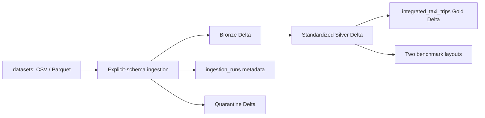

# ID2221 Week 1 Design Report

## 1. Scope and Verified Result

This project integrates three months of NYC yellow-taxi trips, hourly weather, hourly PM2.5 measurements, and the TLC zone lookup into a Spark 3.5.7 / Delta Lake 3.3.2 lakehouse. The platform automatically ingests heterogeneous inputs, validates and standardizes them, integrates one enriched row per accepted taxi trip, and stores every dataset as Delta tables under `lakehouse/`.

Verified runtime (2026-09-12): Windows 11 native, Conda environment `id2221-week1`, OpenJDK 17, Python 3.12, PySpark 3.5.7, delta-spark 3.3.2, Spark `local[8]` with a 4 GB driver heap. Machine-readable acceptance evidence lives in `artifacts/ingestion_verification.json`, `artifacts/integration_verification.json`, and `artifacts/benchmark_report.json`.

Final counts:

| Layer | Table | Rows |
| --- | --- | ---: |
| Silver | `taxi_trips` | 9,551,977 accepted (+ 2,801 quarantined) |
| Silver | `taxi_zones` | 265 |
| Silver | `weather_hourly` | 8,784 |
| Silver | `air_quality_hourly_nyc` | 8,784 (from 51,885 NYC station rows) |
| Gold | `integrated_taxi_trips` | 9,551,977 |

All pickup and dropoff zone joins match. Weather and PM2.5 each miss 19 trips whose pickup times fall outside 2024; those rows remain in Gold with NULL context fields and explicit `missing` match statuses.

---

## 2. Data Catalog

Each dataset is cataloged using the six assignment questions: primary entity, primary key, join attributes, temporal attributes, categorical attributes, and attributes that grow over time.

### 2.1 Yellow-Taxi Trips (three Parquet files, 9,554,778 source rows)

| Question | Answer |
| --- | --- |
| Primary entity | One yellow-taxi trip. |
| Primary key | No explicit trip ID and no proven unique natural key in the source. A SHA-256 fingerprint `trip_id` is computed from normalized business fields for audit only; one duplicate fingerprint is reported and not used for deduplication. |
| Join attributes | `PULocationID` / `DOLocationID` → zone lookup; `tpep_pickup_datetime` → weather (local hour) and air quality (UTC hour after conversion). |
| Temporal attributes | `tpep_pickup_datetime`, `tpep_dropoff_datetime`; derived `trip_duration_minutes`, `pickup_month`, `source_file_month`. |
| Categorical attributes | `VendorID`, `RatecodeID`, `store_and_fwd_flag`, `PULocationID`, `DOLocationID`, `payment_type`. |
| Growing attributes | Trip records accumulate continuously as new monthly files arrive; fare, distance, and surcharge columns are per-trip measures, not partition keys. |

Confirmed quality findings: 751,962 NULLs each in five optional columns across all three months; 2,801 rows with dropoff not after pickup (quarantined); 56 pickups outside the source file month; 136,567 negative fares and 115,895 negative totals (flagged, not deleted); trip distance up to 312,722.3 (flagged above 100).

### 2.2 Weather (`weather.csv`, 8,784 hourly rows)

| Question | Answer |
| --- | --- |
| Primary entity | One city-level hourly weather observation. |
| Primary key | Composite `year + month + day + hour`; all 8,784 keys are unique. Silver stores this as `observation_ts_local`. |
| Join attributes | `observation_ts_local` truncated to hour matches taxi `pickup_ts_local` truncated to hour. |
| Temporal attributes | `year`, `month`, `day`, `hour`; derived `observation_ts_local`. |
| Categorical attributes | All `*_source` columns; encoded fields `cldc`, `coco`. |
| Growing attributes | One new hourly row per clock hour as the calendar advances. |

Confirmed quality findings: `snwd`, `snwd_source`, `wpgt`, `wpgt_source` are entirely NULL; 553 missing precipitation values; source does not declare timezone or station geography.

### 2.3 Taxi Zone Lookup (`taxi_zone_lookup.csv`, 265 rows)

| Question | Answer |
| --- | --- |
| Primary entity | One TLC taxi zone. |
| Primary key | `LocationID`; unique, non-null, range 1–265. |
| Join attributes | `LocationID` joins to taxi pickup and dropoff location IDs. |
| Temporal attributes | None. |
| Categorical attributes | `Borough`, `Zone`, `service_zone`. |
| Growing attributes | Low-frequency reference data; grows only when TLC redefines zones. |

This is a classic small lookup table: broadcast on both pickup and dropoff joins.

### 2.4 Air Quality (`hourly_88101_2024.csv`, 8,139,551 national rows → 51,885 NYC rows → 8,784 hourly rows)

| Question | Answer |
| --- | --- |
| Primary entity | One PM2.5 measurement from a monitoring site and instrument channel at one hour. |
| Primary key | Candidate composite key: `State Code + County Code + Site Num + Parameter Code + POC + Date Local + Time Local`. No duplicates in the NYC subset of 51,885 rows. |
| Join attributes | `Date GMT + Time GMT` → `observation_ts_utc`; spatial fields (state, county, site, lat/lon) used for filtering, not per-trip spatial join. |
| Temporal attributes | `Date Local`, `Time Local`, `Date GMT`, `Time GMT`, `Date of Last Change`; derived `observation_ts_utc`. |
| Categorical attributes | State/county/site codes, `Parameter Code`, `POC`, `Datum`, method and qualifier fields. |
| Growing attributes | Each site/instrument channel adds hourly measurements over time. |

NYC filter retains state code 36 and five county names; only Bronx, Kings, and Queens have active sites (six sites total). Hourly aggregation to one city row is required because 4–6 station observations exist per UTC hour; a direct hourly join would fan out taxi trips.

---

## 3. Storage Architecture

### 3.1 Directory and Delta Organization

```text
Week1/
├── datasets/                    # immutable source inputs (CSV, Parquet)
├── config/datasets.yml          # dataset contracts and paths
├── src/urban_data/              # Spark implementation
├── lakehouse/                   # generated Delta tables
│   ├── bronze/                  # raw values + lineage columns
│   ├── silver/                  # standardized tables
│   ├── gold/integrated_taxi_trips/
│   ├── quarantine/              # rejected records + reasons
│   ├── metadata/ingestion_runs/ # run statistics and lineage
│   └── benchmark/               # two taxi layout experiments
└── artifacts/                   # machine-readable verification evidence
```



Standalone deliverable: [architecture_diagram.png](architecture_diagram.png). Regenerate with `python scripts/export_architecture_diagram.py`.

Bronze preserves source column values and adds `_source_file`, `_source_sha256`, `_ingested_at`, `_run_id`, and `_schema_version`. Silver applies naming, typing, keys, and quality flags. Gold holds only the integrated trip grain. Quarantine and run metadata are also Delta tables.

### 3.2 Naming Conventions

All Silver table and column names use lowercase `snake_case`. Examples: `tpep_pickup_datetime` → `pickup_ts_local`; `PULocationID` → `pu_location_id`; `Airport_fee` → `airport_fee`. Bronze keeps original source names where they differ.

### 3.3 Partitioning Strategy and Design Decisions

| Dataset | Partitioning | Rationale |
| --- | --- | --- |
| `taxi_zones` | None | 265 rows; partitioning would create tiny files and directory overhead. Treat as lookup; broadcast in joins. |
| `weather_hourly` | None | 8,784 rows; whole-table broadcast is cheaper than partition pruning. |
| `air_quality_hourly_nyc` | None | After NYC filter and hourly aggregation, only 8,784 rows remain; broadcast. |
| `taxi_trips` (Silver/Gold) | `source_file_month` | Stable overwrite key per source file. Business `pickup_month` is kept as a regular column because source files contain a small number of out-of-month trips; partitioning on `pickup_month` would risk overwriting valid rows in another month during dynamic overwrite. |
| Benchmark layouts | Unpartitioned vs `pickup_month` | Assignment Task 6 comparison only; not the production Silver layout. |

**Lookup tables:** `taxi_zones` is the only true dimension lookup. Weather and NYC air quality behave as small hourly reference tables after aggregation.

**When partitioning becomes harmful:** high-cardinality keys, severe skew, partitions too small to amortize metadata, queries that do not filter on the partition column (full scans pay directory-listing cost), or writes that produce many small files.

**At 20× data volume:** keep `source_file_month` or move to coarser time partitions only after measuring real query filters; run periodic Delta `OPTIMIZE` / Z-order on common filter columns; target 128–256 MB data files; do not add partition columns speculatively. Incremental ingestion by source hash and schema version already supports append-by-month without rewriting the entire history.

---

## 4. Common Data Model

### 4.1 Standard Timestamp Semantics

Spark session timezone is fixed to UTC at the JVM and SQL level (`TZ=UTC`, `-Duser.timezone=UTC`, `spark.sql.session.timeZone=UTC`). This prevents silent shifts in `make_timestamp` and similar functions.

| Dataset | Stored timestamp | Semantics |
| --- | --- | --- |
| Taxi | `pickup_ts_local`, `dropoff_ts_local` | New York local wall-clock (TLC convention). |
| Weather | `observation_ts_local` | Local wall-clock hour synthesized from `year/month/day/hour`; labeled `local_wall_clock_unconfirmed_timezone` because the CSV declares no timezone. |
| Air quality (station) | `observation_ts_utc` | Parsed from `Date GMT + Time GMT`. |
| Air quality (hourly NYC) | `observation_ts_utc` | One row per UTC hour after city aggregation. |
| Integration join | Taxi pickup converted to UTC hour | Used only to join PM2.5; weather join uses local hour truncation. |

### 4.2 Naming, Types, and Missing Values

- **Naming:** lowercase `snake_case` throughout Silver and Gold.
- **Types:** integer IDs; double for distances, amounts, and environmental measurements; string for flags and status fields; timestamp for all time columns.
- **Missing values:** optional taxi fields and unmatched environment observations remain NULL. NULL is never replaced with zero. Quarantine captures structurally invalid rows (null core timestamps, dropoff ≤ pickup, duplicate weather hour, etc.).
- **Quality flags:** suspicious but retained taxi rows carry a comma-separated `quality_flags` string (`negative_fare`, `negative_total`, `pickup_outside_file_month`, `extreme_trip_distance`).

### 4.3 Transformation Inventory

Every implemented transformation is listed below. Bronze lineage columns are added uniformly by `with_bronze_metadata()`.

| Stage | Dataset | Source → Target | Rule |
| --- | --- | --- | --- |
| Bronze | All | — | Add `_source_file`, `_source_sha256`, `_ingested_at`, `_run_id`, `_schema_version`. |
| Silver | Taxi | Column rename | TLC names → snake_case (`VendorID` → `vendor_id`, etc.). |
| Silver | Taxi | Duration | `trip_duration_minutes = (dropoff − pickup) / 60`. |
| Silver | Taxi | Partition keys | `source_file_month` from config; `pickup_month = date_format(pickup_ts_local, 'yyyy-MM')`. |
| Silver | Taxi | Audit fingerprint | `trip_id = sha2(concat_ws vendor, times, locations, fare, total)`. |
| Silver | Taxi | Quality flags | Flag negative fare/total, pickup outside file month, distance > 100. |
| Silver | Taxi | Quarantine | Reject if pickup or dropoff NULL, or dropoff ≤ pickup. |
| Silver | Zones | Column rename | `LocationID` → `location_id`, `Borough` → `borough`, `Zone` → `zone`. |
| Silver | Zones | Quarantine | Reject NULL or duplicate `location_id`. |
| Silver | Weather | Column rename | Preserve measurement and `*_source` columns in snake_case. |
| Silver | Weather | Timestamp | `observation_ts_local = make_timestamp(year, month, day, hour, 0, 0)`. |
| Silver | Weather | Semantics label | `timestamp_semantics = local_wall_clock_unconfirmed_timezone`. |
| Silver | Weather | Quarantine | Reject incomplete date parts, NULL hour key, or duplicate hour. |
| Silver | Air quality | Column rename | AQS headers → snake_case (`State Code` → `state_code`, etc.). |
| Silver | Air quality | NYC filter | State 36, five NYC county names, parameter 88101. |
| Silver | Air quality | Station timestamp | `observation_ts_utc = to_timestamp(date_gmt + time_gmt)`. |
| Silver | Air quality | Site key | `site_key = county_name / site_num`. |
| Silver | Air quality | Quarantine | Reject NULL UTC time, NULL PM2.5, or negative PM2.5. |
| Silver | Air quality | Hourly aggregate | Group by `observation_ts_utc`; median/mean/min/max PM2.5, site counts. |
| Gold | Integration | Pickup zone | Left join `pu_location_id = location_id`; add zone, borough, match status. |
| Gold | Integration | Dropoff zone | Left join `do_location_id = location_id`. |
| Gold | Integration | Weather | Truncate pickup to hour; left join on `observation_ts_local`; retain observation timestamp and `weather_lag_minutes`. |
| Gold | Integration | Air quality | Convert pickup to UTC hour; left join on `observation_ts_utc`; retain observation timestamp and `air_quality_lag_minutes`. |

---

## 5. Generic Ingestion Framework

The framework in `src/urban_data/ingest.py` orchestrates reads, validation, transforms, Delta writes, quarantine, and metadata. Dataset contracts live in `config/datasets.yml`; schemas in `schemas.py`; transforms in `transforms.py`.

### 5.1 Assignment Questions

**1. Which components are generic and reusable?**

File discovery and format dispatch (CSV vs Parquet), explicit schema application, Bronze lineage injection, row-count reconciliation, Delta write helpers, quarantine append, successful-run metadata append, idempotent skip on unchanged source hash + schema version, and CLI orchestration in `main.py`.

**2. Which components remain dataset-specific, and why?**

PySpark `StructType` definitions, column rename maps, timestamp synthesis rules, NYC air-quality filter, hourly PM2.5 aggregation, taxi quality/quarantine logic, and Silver partition columns differ because each department uses a different physical schema and business grain. These are isolated in `transforms.py` and referenced by `kind` in config rather than duplicated per file.

**3. How are transformation rules defined and maintained?**

Rules are code functions keyed by dataset `kind` (`taxi_trips`, `taxi_zones`, `weather_hourly`, `air_quality_hourly_nyc`). Operational differences (path, file month, expected rows, Delta paths) are YAML only. A schema version string in config gates breaking changes: bump the version to force re-ingestion.

**4. How is metadata managed?**

Each successful run appends one row to `lakehouse/metadata/ingestion_runs/` with `run_id`, dataset key, source file, SHA-256, schema version, rows read/accepted/quarantined, timestamps, and status. Skipped runs (unchanged hash) return a payload without rewriting Silver. Failed runs currently raise exceptions without a failure metadata row—documented as a known gap.

**5. How does the design reduce duplication?**

One ingest pipeline handles Bronze → quality split → Silver/quarantine → metadata. Adding a new taxi month requires only a new YAML block pointing at the next Parquet file, not a new ingest script.

**6. If 20 new datasets arrive next year?**

Add 20 config entries, extend `schemas.py` and `transforms.py` only where a new `kind` is needed, reuse the same ingest orchestration. Shared kinds (e.g., another hourly CSV with the same contract) need config only. Regression coverage should add verify scripts or unit tests per new kind; partition and broadcast rules should be chosen from the Task 2 decision table rather than copied from taxi defaults.

### 5.2 Data Quality Policy

| Level | Examples | Action |
| --- | --- | --- |
| Quarantine | Invalid timestamps, dropoff ≤ pickup, duplicate weather hour, NULL zone key | Write to `quarantine/` Delta with reason columns |
| Flag and retain | Negative fare, out-of-month pickup, extreme distance | Stay in Silver with `quality_flags` |
| Allow NULL | Optional taxi fields, unmatched weather/AQ hour | NULL + explicit `*_match_status` in Gold |

---

## 6. Integration Strategy

Gold table `integrated_taxi_trips` performs four sequential left joins on 9,551,977 accepted taxi rows. Row count is asserted unchanged after each step; zone and hourly environment keys are asserted unique before joining to prevent fan-out.

| Context | Association rule | Missing data |
| --- | --- | --- |
| Pickup / dropoff zone and borough | Equi-join on TLC `location_id` | Not observed in current data (100% match) |
| Weather | Truncate `pickup_ts_local` to hour = `observation_ts_local` | 19 trips outside 2024 → NULL weather fields, `weather_match_status = missing` |
| Air quality | Convert pickup to UTC, truncate to hour = aggregated `observation_ts_utc` | Same 19 trips → NULL PM2.5 fields, `air_quality_match_status = missing` |

**Weather hourly association:** exact hour match on local wall-clock because the weather file is a single city-level hourly series without station ID. This assumes TLC local pickup time aligns with the weather file's implicit locality; the source does not prove that assumption.

**Air-quality hourly association:** city-level median PM2.5 across six Bronx/Kings/Queens sites for the UTC hour of pickup. Manhattan and Staten Island have no stations in the filtered data, so the value is a city estimate, not zone-level exposure.

**Limitations:** no sub-hour interpolation; no nearest-station spatial join; hour truncation hides intra-hour variation; weather timezone remains unconfirmed; one duplicate audit `trip_id` is reported but not removed.

---

## 7. Benchmark and Engineering Trade-offs

Task 6 compares two materializations of the same 9,551,977-row Silver taxi table: unpartitioned Delta vs partitioned by `pickup_month`. Measurements are in `docs/benchmark_report.md` and `artifacts/benchmark_report.json`.

On the verified Windows run (2026-09-12):

| Metric | Unpartitioned | `pickup_month` partitioned |
| --- | ---: | ---: |
| Materialization time (source Parquet → Delta layout) | 18.5 s | 17.3 s |
| Data size / file count | 815.0 MiB / 10 files | 820.0 MiB / 23 files |
| Query medians (3 assigned aggregates) | 491–539 ms | 506–559 ms |

All three queries scan the full dataset; neither layout benefits from partition pruning. Query results are identical (SHA-256 verified). **Default recommendation: unpartitioned storage** for the current full-range workload because query latency is effectively tied while file count and operational complexity stay lower. Revisit month partitioning when month-filtered reads or retention policies dominate.

**Trade-off note:** benchmark write time measures source Parquet read, Silver acceptance transforms, and Delta commit for each layout. Storage metrics come from Delta `DESCRIBE DETAIL` active snapshot fields (`numFiles`, `sizeInBytes`).

---

## 8. Limitations and Open Items

- Weather timezone and station geography are not declared by the source; local wall-clock joining is an explicit, labeled assumption.
- Taxi negative amounts may be legitimate reversals; they are flagged, not deleted.
- No proven unique taxi trip key; `trip_id` is audit-only.
- Air-quality PM2.5 is city-level, not per pickup zone.
- Schema validation enforces physical Parquet column names, order, and compatible types before typed reads; CSV types are enforced by FAILFAST typed parsing.
- Benchmark write time measures source Parquet ingestion into each comparison layout, not Silver-table rematerialization.

Evidence cross-reference: raw profiling in `artifacts/data_profile.json`; ingestion in `artifacts/ingestion_verification.json`; integration in `artifacts/integration_verification.json`; benchmark in `artifacts/benchmark_report.json` and `artifacts/benchmark_physical_plans.json`.
