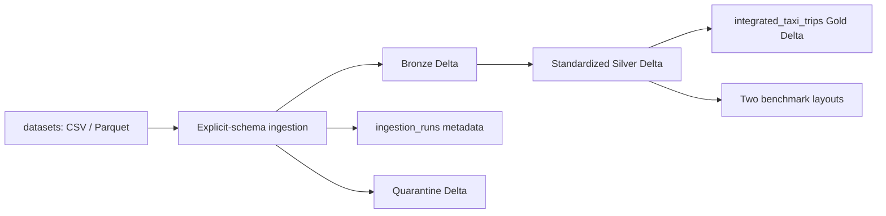

# ID2221 Week 1 Design Report

## 1. Scope and Result

This project integrates three months of NYC yellow-taxi trips, hourly weather, hourly PM2.5 measurements, and the TLC zone lookup into a Spark 3.5.7 / Delta Lake 3.3.2 lakehouse. The pipeline reads explicit schemas, preserves lineage, separates accepted records from quarantined records, builds one Gold row per accepted taxi trip, and benchmarks two storage layouts.

The final Gold table contains 9,551,977 rows, exactly matching the accepted Silver taxi rows. All pickup and dropoff zone joins match. Weather and PM2.5 each miss 19 records because those trips have pickup times outside 2024; those trips remain in Gold with NULL context fields and explicit `missing` statuses.

## 2. Data Catalog

| Dataset | Entity and key | Join and time attributes | Important quality findings |
| --- | --- | --- | --- |
| Yellow-taxi trips | One trip; source has no proven unique key. A row fingerprint is generated as `trip_id` for audit only. | `pu_location_id`, `do_location_id`, pickup/dropoff local timestamps. | 2,801 invalid-time rows are quarantined. Negative amounts, extreme distances, and out-of-file-month pickup times remain and carry flags. |
| Taxi zones | One TLC zone; `location_id` is unique. | Both taxi location IDs. | All 265 zones are unique and all trip locations match. |
| Weather | One city-level hourly observation; composite source hour is unique. | Pickup local hour. | 8,784 hours cover 2024. The source does not declare a station or timezone, so the join is explicitly labeled local wall-clock. |
| Air quality | One station/instrument observation; source candidate key is unique in the NYC subset. | UTC observation hour after aggregation. | NYC has 51,885 valid station rows from six sites. Values are aggregated to one city row per UTC hour before joining. |

The air-quality table contains stations only in Bronx, Kings, and Queens. Therefore the joined PM2.5 value is a city-level estimate, not a taxi-zone exposure measurement.

## 3. Storage Architecture

Raw inputs are immutable under `datasets/`. Bronze keeps source values and adds `_source_file`, `_source_sha256`, `_ingested_at`, `_run_id`, and `_schema_version`. Silver applies names, types, timestamps, keys, and quality flags. Gold is limited to the integrated trip grain. Quarantine and run metadata are Delta tables under `lakehouse/`.

Zone, weather, and NYC hourly air-quality tables are small and unpartitioned. Taxi Silver is partitioned by `source_file_month`, not by the business-derived `pickup_month`: a source file can contain a small number of out-of-month trips, and dynamic overwrite on `pickup_month` would erase valid rows in another month's partition. Gold uses the same stable source-month partition. For much larger data, the next likely adjustment is a coarser time partition plus periodic Optimize/Z-order after real query patterns are known; more partition columns should not be added speculatively.

## 4. Common Model and Ingestion

All Silver names are lowercase `snake_case`. IDs are integers, measurements are doubles, missing measurements remain NULL, and timestamps are stored under a fixed UTC Spark session. Taxi and weather wall-clock values retain local semantics; PM2.5 uses its source GMT time. A taxi pickup is converted from `America/New_York` to UTC only to join PM2.5.

The reusable framework performs file discovery, explicit CSV/Parquet reads, schema validation, Bronze lineage, row-count reconciliation, Delta writes, quarantine, and run metadata. Dataset-specific code is limited to schemas and transformations in `src/urban_data/transforms.py`; configuration lives in `config/datasets.yml`. A successful source hash and schema version is skipped on retry, while `--force` deliberately rebuilds a source.

Final ingestion reconciliation is machine-readable in `artifacts/ingestion_verification.json`: 9,554,778 source taxi rows become 9,551,977 accepted rows and 2,801 quarantined rows. Zones, weather, and NYC hourly PM2.5 reconcile to 265, 8,784, and 8,784 rows respectively.

## 5. Integration and Benchmark Decisions

Gold performs four left joins in sequence: pickup zone, dropoff zone, weather hour, and PM2.5 UTC hour. The row count is checked after every join. Zone keys and hourly environment keys are asserted unique before joining, preventing fan-out. Missing environment observations are not imputed.

The benchmark materializes the same 9,551,977-row Silver input as an unpartitioned Delta table and a `pickup_month`-partitioned table. The partitioned layout wrote faster in the single measured materialization, but produced 46 smaller files and was slower for all three full-range queries. Therefore unpartitioned storage is the better default for the assignment's current queries; month partitioning is only justified when filtered reads become dominant. Full measurements are in `docs/benchmark_report.md`.

## 6. Limitations

The weather timezone and station meaning are not declared by the source. Taxi timestamps are treated as New York local wall-clock, which is the TLC convention, and the uncertainty is retained in the weather timestamp semantics. Taxi negative amounts may be reversals, so they are flagged rather than deleted. The source has no reliable trip ID; one duplicate audit fingerprint is reported rather than silently removed.
